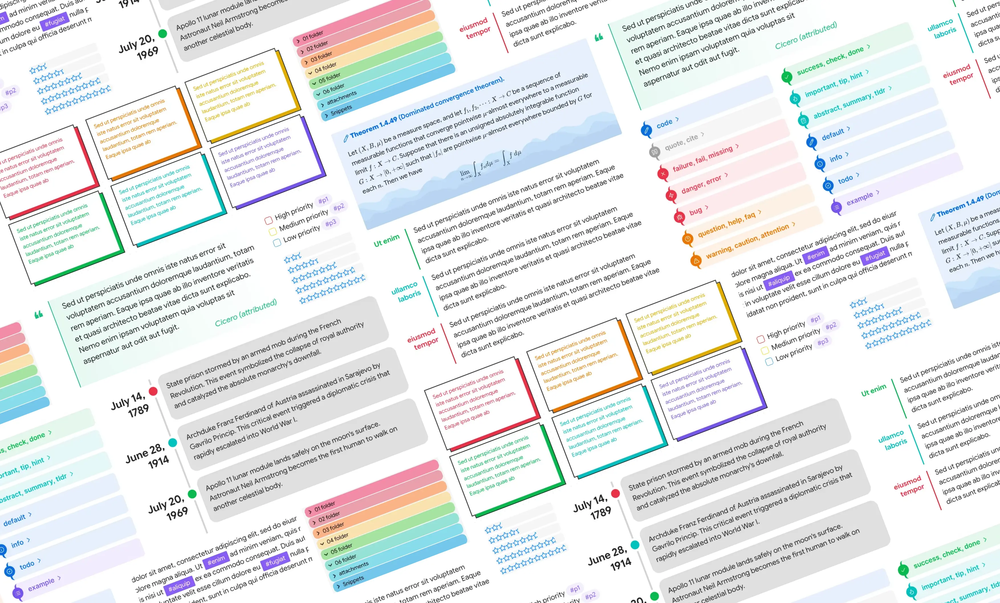

# Obsidian CSS Snippets Collection

A collection of community CSS snippets for customizing ObsidianMD's interface.

**Table of Contents:**

1. [Introduction](#-Introduction)
2. [Compatibility](#-Compatibility)
3. [How to Use](#-How-to-Use)
4. [Included Snippets](#-Included-Snippets)
5. [Additional Resources and Links](#-additional-resources-and-links)
6. [Credits](#-Credits)
7. [License](#-License)

## ◩ Introduction

Hey there! Welcome to the ObsidianMD CSS Snippets repository. It's a collection of CSS code snippets for ObsidianMD—no fuss, just a bunch of useful snippets. These come from different folks in the ObsidianMD community, so you'll find a variety of styles and tweaks. Enjoy experimenting with them to customize your ObsidianMD experience!

## ◩ Compatibility

Tested on Obsidian **1.12.7** with the default theme. Future Obsidian updates may cause these to break.

## ◩ How to Use

1. Open **Settings**.
2. Under **Appearance → CSS snippets**, select **Open snippets folder** (folder icon).
3. In the snippets folder, create a CSS file, paste in the CSS from the snippet you want, and save.
4. In Obsidian, under **Appearance → CSS snippets**, select **Reload snippets** (refresh icon) to see the snippet in the list.

You can either grab the whole vault at once, or copy snippets individually:

1. **Download Entire Vault:** [Download the vault](https://github.com/r-u-s-h-i-k-e-s-h/Obsidian-CSS-Snippets/archive/refs/heads/Collection.zip), and open it in Obsidian via `Open another vault → Open folder as vault → Reload the vault`

2. **Individual Snippets:** Alternatively, for a more granular approach, open the links below to view and copy each individual CSS snippet.

## ◩ Included Snippets

 
Click to expand/collapse

- [blockquote styling - 01.md](snippets-new/blockquote%20styling%20-%2001.md)
- [blockquote styling - 02.md](snippets-new/blockquote%20styling%20-%2002.md)
- [blockquote styling - 03.md](snippets-new/blockquote%20styling%20-%2003.md)
- [calendar - rainbow headers.md](snippets-new/calendar%20-%20rainbow%20headers.md)
- [callout styling - 3 callouts.md](snippets-new/callout%20styling%20-%203%20callouts.md)
- [callout styling - animated water wave.md](snippets-new/callout%20styling%20-%20animated%20water%20wave.md)
- [callout styling - author callout.md](snippets-new/callout%20styling%20-%20author%20callout.md)
- [callout styling - bordered hollow.md](snippets-new/callout%20styling%20-%20bordered%20hollow.md)
- [callout styling - bottom pill.md](snippets-new/callout%20styling%20-%20bottom%20pill.md)
- [callout styling - bullet icon.md](snippets-new/callout%20styling%20-%20bullet%20icon.md)
- [callout styling - celtic border.md](snippets-new/callout%20styling%20-%20celtic%20border.md)
- [callout styling - centred title.md](snippets-new/callout%20styling%20-%20centred%20title.md)
- [callout styling - classic.md](snippets-new/callout%20styling%20-%20classic.md)
- [callout styling - collapsible image caption.md](snippets-new/callout%20styling%20-%20collapsible%20image%20caption.md)
- [callout styling - compact quote callout.md](snippets-new/callout%20styling%20-%20compact%20quote%20callout.md)
- [callout styling - folder structure.md](snippets-new/callout%20styling%20-%20folder%20structure.md)
- [callout styling - gummy callout.md](snippets-new/callout%20styling%20-%20gummy%20callout.md)
- [callout styling - icon to the top right corner.md](snippets-new/callout%20styling%20-%20icon%20to%20the%20top%20right%20corner.md)
- [callout styling - label callout.md](snippets-new/callout%20styling%20-%20label%20callout.md)
- [callout styling - leader list.md](snippets-new/callout%20styling%20-%20leader%20list.md)
- [callout styling - lyric callout.md](snippets-new/callout%20styling%20-%20lyric%20callout.md)
- [callout styling - outlined callout.md](snippets-new/callout%20styling%20-%20outlined%20callout.md)
- [callout styling - power callout.md](snippets-new/callout%20styling%20-%20power%20callout.md)
- [callout styling - qna callout.md](snippets-new/callout%20styling%20-%20qna%20callout.md)
- [callout styling - quote callout.md](snippets-new/callout%20styling%20-%20quote%20callout.md)
- [callout styling - responsive aside.md](snippets-new/callout%20styling%20-%20responsive%20aside.md)
- [callout styling - scroller callout.md](snippets-new/callout%20styling%20-%20scroller%20callout.md)
- [callout styling - sleek callout (anuppuccin theme).md](snippets-new/callout%20styling%20-%20sleek%20callout%20(anuppuccin%20theme).md)
- [callout styling - tabbed callout.md](snippets-new/callout%20styling%20-%20tabbed%20callout.md)
- [callout styling - theorem callout.md](snippets-new/callout%20styling%20-%20theorem%20callout.md)
- [callout styling - timeline callout.md](snippets-new/callout%20styling%20-%20timeline%20callout.md)
- [callout styling - wikipedia style infobox.md](snippets-new/callout%20styling%20-%20wikipedia%20style%20infobox.md)
- [callout styling - without icon.md](snippets-new/callout%20styling%20-%20without%20icon.md)
- [canvas styling - brutalist.md](snippets-new/canvas%20styling%20-%20brutalist.md)
- [canvas styling - gradient cards.md](snippets-new/canvas%20styling%20-%20gradient%20cards.md)
- [canvas styling - no border background when it has callout.md](snippets-new/canvas%20styling%20-%20no%20border%20background%20when%20it%20has%20callout.md)
- [canvas styling - vertical menu to the bottom-right corner.md](snippets-new/canvas%20styling%20-%20vertical%20menu%20to%20the%20bottom-right%20corner.md)
- [checkbox - faded completed tasks.md](snippets-new/checkbox%20-%20faded%20completed%20tasks.md)
- [code block - accent coloured outline.md](snippets-new/code%20block%20-%20accent%20coloured%20outline.md)
- [code block - language label.md](snippets-new/code%20block%20-%20language%20label.md)
- [code block - left border accent.md](snippets-new/code%20block%20-%20left%20border%20accent.md)
- [command palette - change size and position.md](snippets-new/command%20palette%20-%20change%20size%20and%20position.md)
- [command palette - dense.md](snippets-new/command%20palette%20-%20dense.md)
- [custom checkbox - anuppuccin theme.md](snippets-new/custom%20checkbox%20-%20anuppuccin%20theme.md)
- [custom checkbox - minimal theme.md](snippets-new/custom%20checkbox%20-%20minimal%20theme.md)
- [custom checkbox - origami theme.md](snippets-new/custom%20checkbox%20-%20origami%20theme.md)
- [custom checkbox - task priorities.md](snippets-new/custom%20checkbox%20-%20task%20priorities.md)
- [custom checkbox - task progress.md](snippets-new/custom%20checkbox%20-%20task%20progress.md)
- [editor - custom badge and tooltip.md](snippets-new/editor%20-%20custom%20badge%20and%20tooltip.md)
- [editor - paper grid background.md](snippets-new/editor%20-%20paper%20grid%20background.md)
- [empty tab - custom icon animation.md](snippets-new/empty%20tab%20-%20custom%20icon%20animation.md)
- [empty tab - custom icon disappearing transition.md](snippets-new/empty%20tab%20-%20custom%20icon%20disappearing%20transition.md)
- [explorer styling - custom folder description.md](snippets-new/explorer%20styling%20-%20custom%20folder%20description.md)
- [explorer styling - custom folder group header.md](snippets-new/explorer%20styling%20-%20custom%20folder%20group%20header.md)
- [explorer styling - new note button.md](snippets-new/explorer%20styling%20-%20new%20note%20button.md)
- [explorer styling - rainbow folder background.md](snippets-new/explorer%20styling%20-%20rainbow%20folder%20background.md)
- [explorer styling - rainbow folder titles.md](snippets-new/explorer%20styling%20-%20rainbow%20folder%20titles.md)
- [headings - indicators trailing.md](snippets-new/headings%20-%20indicators%20trailing.md)
- [headings - prefix symbol.md](snippets-new/headings%20-%20prefix%20symbol.md)
- [headings - rainbow underline and hr.md](snippets-new/headings%20-%20rainbow%20underline%20and%20hr.md)
- [image styling - alt text overlay on hover.md](snippets-new/image%20styling%20-%20alt%20text%20overlay%20on%20hover.md)
- [image styling - gallery ui.md](snippets-new/image%20styling%20-%20gallery%20ui.md)
- [image styling - grid layout.md](snippets-new/image%20styling%20-%20grid%20layout.md)
- [image styling - zoom on click.md](snippets-new/image%20styling%20-%20zoom%20on%20click.md)
- [inline title - celtic styling.md](snippets-new/inline%20title%20-%20celtic%20styling.md)
- [link styling (external) - custom icon.md](snippets-new/link%20styling%20(external)%20-%20custom%20icon.md)
- [link styling (external) - squiggly effect on hover.md](snippets-new/link%20styling%20(external)%20-%20squiggly%20effect%20on%20hover.md)
- [list styling (unordered) - alternating hollow bullets.md](snippets-new/list%20styling%20(unordered)%20-%20alternating%20hollow%20bullets.md)
- [list styling (unordered) - coloured list.md](snippets-new/list%20styling%20(unordered)%20-%20coloured%20list.md)
- [list styling (unordered) - custom bullet icon.md](snippets-new/list%20styling%20(unordered)%20-%20custom%20bullet%20icon.md)
- [list styling (unordered) - nested bullet symbols.md](snippets-new/list%20styling%20(unordered)%20-%20nested%20bullet%20symbols.md)
- [popover - accent coloured outline.md](snippets-new/popover%20-%20accent%20coloured%20outline.md)
- [progress bar - star rating.md](snippets-new/progress%20bar%20-%20star%20rating.md)
- [properties - column layout.md](snippets-new/properties%20-%20column%20layout.md)
- [properties - show on hover.md](snippets-new/properties%20-%20show%20on%20hover.md)
- [ribbon - accent coloured background.md](snippets-new/ribbon%20-%20accent%20coloured%20background.md)
- [settings - accent coloured sidebar headings.md](snippets-new/settings%20-%20accent%20coloured%20sidebar%20headings.md)
- [settings - change size and position.md](snippets-new/settings%20-%20change%20size%20and%20position.md)
- [settings - dense.md](snippets-new/settings%20-%20dense.md)
- [settings - left aligned controls.md](snippets-new/settings%20-%20left%20aligned%20controls.md)
- [sidebar - custom tab icon.md](snippets-new/sidebar%20-%20custom%20tab%20icon.md)
- [sidebar - hide ribbon on collapse.md](snippets-new/sidebar%20-%20hide%20ribbon%20on%20collapse.md)
- [sidebar - no animations.md](snippets-new/sidebar%20-%20no%20animations.md)
- [sidebar - outline numbering.md](snippets-new/sidebar%20-%20outline%20numbering.md)
- [sidebar - rainbow tab icon.md](snippets-new/sidebar%20-%20rainbow%20tab%20icon.md)
- [sidebar - show tab icon on hover.md](snippets-new/sidebar%20-%20show%20tab%20icon%20on%20hover.md)
- [stacked tabs - vertical title.md](snippets-new/stacked%20tabs%20-%20vertical%20title.md)
- [table styling - first column header.md](snippets-new/table%20styling%20-%20first%20column%20header.md)
- [table styling - rounded corners.md](snippets-new/table%20styling%20-%20rounded%20corners.md)
- [tag styling - brutalist.md](snippets-new/tag%20styling%20-%20brutalist.md)
- [tag styling - hide hash symbol.md](snippets-new/tag%20styling%20-%20hide%20hash%20symbol.md)
- [tag styling - simple tags.md](snippets-new/tag%20styling%20-%20simple%20tags.md)
- [tag styling - target specific tag.md](snippets-new/tag%20styling%20-%20target%20specific%20tag.md)
- [text styling - spoiler text.md](snippets-new/text%20styling%20-%20spoiler%20text.md)
- [titlebar - breadcrumb separator.md](snippets-new/titlebar%20-%20breadcrumb%20separator.md)
- [tooltip styling - accent coloured background.md](snippets-new/tooltip%20styling%20-%20accent%20coloured%20background.md)
- [workspace -  card ui.md](workspace%20-%20card%20ui.md)
- [workspace - colourful tabs.md](snippets-new/workspace%20-%20colourful%20tabs.md)
- [workspace - custom background image.md](snippets-new/workspace%20-%20custom%20background%20image.md)
- [workspace - hide window button panel.md](snippets-new/workspace%20-%20hide%20window%20button%20panel.md)
- [workspace - left aligned title bar.md](snippets-new/workspace%20-%20left%20aligned%20title%20bar.md)
- [workspace - mini mode.md](snippets-new/workspace%20-%20mini%20mode.md)
- [workspace - multi column.md](snippets-new/workspace%20-%20multi%20column.md)
- [workspace - resize scroll bar.md](snippets-new/workspace%20-%20resize%20scroll%20bar.md)
- [workspace - simple editor.md](snippets-new/workspace%20-%20simple%20editor.md)
- [workspace - square ui.md](snippets-new/workspace%20-%20square%20ui.md)

**NOTE**: _A few snippets aren't reproduced here due to licensing restrictions from the original author — check the source link on each snippet's page for the full code._

## ◩ Additional Resources and Links

 
Click to expand/collapse

- [#appearance](https://discord.com/channels/686053708261228577/702656734631821413) / Obsidian discord
- [Obsidian CSS Quick Guide](https://forum.obsidian.md/t/obsidian-css-quick-guide/58178) by FireIsGood (mostly about using the inspector)
- [CSS Variables at Obsidian Dev Docs](https://docs.obsidian.md/Reference/CSS+variables/CSS+variables)
- replete / [obsidian-minimal-theme-css-snippets](https://github.com/replete/obsidian-minimal-theme-css-snippets)
- efemkay / [obsidian-modular-css-layout](https://github.com/efemkay/obsidian-modular-css-layout#wide-views)
- SlRvb's [snippets collection](https://github.com/SlRvb/Obsidian--ITS-Theme/tree/main/Snippets) | [Guide](https://publish.obsidian.md/slrvb-docs/ITS+Theme/ITS+Theme)
- zamsyt / [obsidian-snippets](https://github.com/zamsyt/obsidian-snippets)
- ElsaTam(Kapirklaa) / [Obsidian-Stuff](https://github.com/ElsaTam/Obsidian-Stuff)
- KuiyueRO / [Obsidian-Miner](https://github.com/KuiyueRO/Obsidian-Miner)
- HandaArchitect / [obsidian-banner-snippet](https://github.com/HandaArchitect/obsidian-banner-snippet)
- sailKiteV / [Obsidian-Snippets-and-Demos](https://github.com/sailKiteV/Obsidian-Snippets-and-Demos?tab=readme-ov-file)
- TfTHacker / [DashboardPlusPlus](https://github.com/TfTHacker/DashboardPlusPlus)
- eb2ai / [My-Checklists-and-Icons](https://github.com/eb2ai/My-Checklists-and-Icons?tab=readme-ov-file)
- felixqueisler / [Obsidian-FileLink-Styling](https://github.com/felixqueisler/Obsidian-FileLink-Styling)
- xhuajin / [obsidian-sidenote-callout](https://github.com/xhuajin/obsidian-sidenote-callout/tree/main)

## ◩ Credits

A special thanks to the creators of the original snippets and the ObsidianMD community for sharing their expertise and contributions.

- 🪁 **sailKite** (sailKitev@gmail.com | [GitHub](https://github.com/sailKiteV))
- 🔥 **FireIsGood** ([Support link](https://ko-fi.com/fireisgood) | [GitHub](https://github.com/FireIsGood))
- 💎 **kneecaps** ([Support link](https://ko-fi.com/ogkneecaps) | [GitHub](https://github.com/7368697661))
- 😎 **rushi** (Let me have some credit for minimal tweaks 😁)
- 💖 and many more amazing contributors

## ◩ License

This project is licensed under the MIT License - see the [LICENSE](LICENSE) file for details.

---

Happy theming and customizing your ObsidianMD experience!

[]~(￣▽￣)~*
